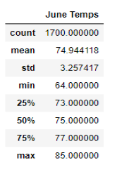
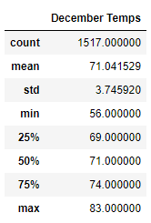

# surfs_up

## Overview of Project

### Purpose

W. Avy has requested mor information on the temperature trends for the months of June and December.
The following analysis will provide insights into the temperature trends of the Oahu area in Hawaii in order to
provide insight into he sustainability to operate an ice cream shop business year-round.

## Results

### Comparison of June and December Temperatures

From the review of the data the following has been determined:
 - The data shows less temperature readings for the month of December with only 1517 readings considering December has more days than June compared to June showing 1700 Temperature readings
 - The average temperature for June and December is within a 4 degree difference from 71 degrees for June and 74.9 degrees for December
 - There is a significant difference between the minimum temperatures with June showing a minimum of 64 degrees and December a minimum of 56 degrees

 

## Summary

### High Level Summary

From the analysis above the summary of the temperature data indicates there is no significant difference in
temperature trends when comparing the half year June and end year December results.

### Additional Analysis
The following two additional queries would gather data for precipitation for the months of June and December in order
to provide insight into the weather conditions in the Oahu region
#### June Precipitation
 - june_prcp = session.query(Measurement.prcp).filter(func.strftime("%m", Measurement.date) == '06').all()
 
#### December Precipitation
 - dec_prcp = session.query(Measurement.prcp).filter(func.strftime("%m", Measurement.date) == '12').all()

